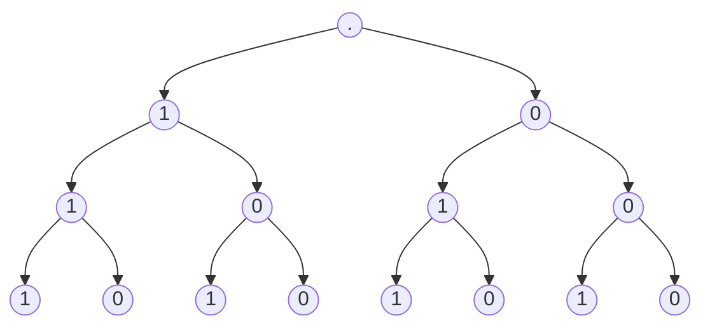

# Loi binomiale.
Lycée du Granier: classe Terminale.

## Prérequis sur les probabilités.

**Propriété multiplicative**, pour $E_1, E_2, ..., E_n$ des événements aléatoires **indépendants** de probabilités  $p_1, p_2, ..., p_n$:
$$
P[E_1 \cap E_2 \cap ... \cap E_n] = p_1 \times p_2 \times ...\times p_n
$$
ou, plus formellement, pour $n \in \mathbb{N}^*$:
$$
P[ \bigcap_{i=1}^{n} E_i ] = \prod_{i=1}^{n} p_i
$$

**Probabilités conditionnelles**, cherchons la probabilité de $A$ _sachant_ $B$:
$$
P_{B}[A] = P[A \mid B] = \frac{P[A \cap B]}{P[B]}
$$

**Coefficients binomiaux** $\binom{n}{k}$:  
[[CoefficientsBinomiaux]]

## Loi binomiale: définition.

Nous disons que $X$ suit une _loi binomiale_ de probabilité de succès $p \in [0; 1]$ et de répétitions $n \in \mathbb{N}^*$, nous écrivons:
$$
X: B(n; p)
$$
ou, plus formellement:
$$
X \sim B(n; p)
$$

La loi binomiale sert à *compter le nombre de succès* d'une répétition de $n$ experiences binaires (soit succès, soit échec) de probabilité de succès $p$. Ainsi, pour savoir la probabilité d'avoir $k$ succès, notons:
$$
P[X = k] = \binom{n}{k} \; p^{k} \; (1-p)^{n - k}
$$

### Experiences de Bernoulli.

Chaque tirage $Y$:
- est indépendant des précédents;
- se réalise tous dans les même conditions, nous assimilons à un _tirage avec remise_.
- suit un schéma schéma binarie, ou formellement, d'une _experience de Bernoulli_, c'est à dire qu'il a pour loi de succès $S$:

| $Y = y_i$    | $S$ | $\bar{S}$ |
| ------------ | --- | --------- |
| $P[Y = y_i]$ | $p$ | $1-p$     |

### Visualisation de la loi binomiale.

Posons $X \sim B(3; 0.6)$.

Un arbre des succès $S$ (1) et échecs $\bar{S}$ (0) pour $n = 3$ répétitions et $p = 0.6$ probabilité de succès:

Nous avons 2 résultats évidents:

- En "collant à gauche", suivant la branche faite uniquement de succès (1), nous en comptons 3. En utilisant la propriété multiplicative, pour la branche $(1; 1; 1)$, nous avons:
$$
P[X = 3] = p^{3}
$$
- De même en "collant à droite", pour la branche $(0; 0; 0)$ avec 0 succès, nous avons:
$$
P[X = 0] = (1 - p)^3
$$

Cependant, les autres branches sont plus complexes: plusieurs branches vont avoir le même nombre de succès.
- _Par exemple_: $(1; 1; 0), (1; 0; 1), (0; 1; 1)$, avec 2 succès chacune et 1 échec. 
	- Nous remarquons que c'est une _combinaison_ de 2 éléments parmi 3:
$$
\binom{3}{2} = 3
$$
	- La probabilité d'une de ces branche est, selon la propriété multiplicative: 
$$
p^{2} \times (1-p)^{1}
$$
	- Donc la probabilité qu'une des trois branche soit choisie est:
$$
P[X = 2] = 3 \times p^{2} \times (1-p)^{1}
$$

Ainsi, généralisons et prenons pour $n$ tirages:
- le nombre de combinaisons pour $k$ succès: $\binom{n}{k}$,
- la probabilité qu'il passe $k$ succès: $p^{k}$,
- et, n'oublions pas, la probabilité ($1 - p$) des échecs restants ($n - k$): $(1-p)^{n - k}$ 

Et nous avons notre loi binomiale:
$$
P[X = k] = \binom{n}{k} \; p^{k} \; (1-p)^{n - k}
$$

## Manipulations utiles.

$$
X \sim B(n; p)
$$

Inégalités, $k < n$ :
- Nous pouvons utiliser l'onglet probabilité de la calculatrice.
- Nous pouvons compter, dénombrer et utiliser le principe additif:
$$
P[X \geq k] =  \sum_{i=k}^{n} {P[X = i]} = P[X = k] + P[X = k+1] \; + \; ... \; + P[X = n]
$$

- Nous pouvons la probabilité contraire:
$$
P[X > 0] = 1 - P[X = 0]
$$
